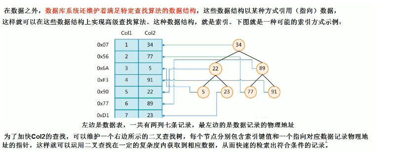

## Mysql_zy

#### 1.索引优化分析

> 为什么性能下降SQL慢， 执行时间长，等待时间长

查询语句写的烂，索引失效(单值，复合)，关联查询太多的join(设计缺陷)， 服务器调优与参数设置

#### 2.常见的通用join查询

SQL执行顺序

```txt
人的书写sql的逻辑：
select distinct
    <select_list>
from
   <left_table> <join_type>
join <right_table> on <join_condition>
where
     <where_condition>
group by
     <group_by_list>
having 
     <having_condition>
order by
     <order_by_condition>
limit  <limit_number>
--------------------------------------
sql执行的顺序
from <left_table>
on <join_condition>
<join_type> join <right_table>
where <wehre_condition>
group by <group_by_list>
having <having_condition>
select 
distinct <select_list>
order by <order_by_condition>
limit <limit_number>
```

> 总结

sql解析：笛卡尔积优先然后主表保留，join和where的优先级相当，group by > having,select > order by > limit

#### 3. 7种join

select <select_list> from table A left join Table B on A.key = B.key  

select <select_list> from table A right join Table B on  A.key = B.key

select <select_list> from table A inner join table B on A.key = B.key

select <select_list> from table A left join table B on A.key = B.key where B.key is NULL

select <select_list> from table A right join table B on A.key = B.key where A.key is NULL

select <select_list> from table A full outer join table B on A.key = B.key

select <select_list> from table A full outer join table B on A.key = B.key wehre A.key is NULL or B.key is NULL

#### 4.索引

1. 定义： 索引(index)是帮助MySql高效的获取数据的数据结构，索引的本质：索引是数据结构
2. 可以理解为"排好序的快速查找的数据结构"



3. 数据本身之外，数据库还维护一个满足特定查找算法的数据结构，这些数据结构以某种方式指向数据，这样就可以在这些数据结构的基础上实现高级查找算法，这种数据结构就是索引。

4. 一般来说索引本身也很大， 不可能全部存储在内存中，因此索引往往以文件形式存在硬盘上
5. 我们平时说的索引，如果没有特别指明，都是B树(多路搜索树，并不一定是二叉树)结构组织的索引。其中聚集索引，次要索引，覆盖索引，符合索引，前缀索引，唯一索引默认都是B+树索引，统称索引。当然除了B+还有哈希索引(hash index)等。

#### 优势

1. 类似大学图书馆数目索引提高数据检索效率，降低数据库的IIO成本
2. 通过索引列对数据进行排序，降低数据排序成本，降低CPU的消耗

#### 劣势

1. 实际上索引也是一张表，该表保存了主键和索引字段，并指向实体表的记录，索引索引列也是要占用空间的
2. 虽然索引大幅度提高了查询速度，但是会降低更新表的速度，如果对表insert, update, delete因为更新表时，mysql不仅要存储数据，还有保存一下索引文件每次更新添加了索引列的字段，都会调整因为更新都会带来索引键值变化后的索引信息
3. 索引只是提高效率的一个因素，如果你的mysql有大数据量的表，就需要花时间建立研究优秀的索引，或者优化查询语句

#### 索引分类

* 单值索引： 一个索引只包含单个列一个表可以有多个单列索引(建立一张表索引不要超过5个，优先考虑符合索引)
* 唯一索引：索引列的值必须唯一，但允许有空值
* 复合索引：即一个索引包含多个列

#### 基本语法

* 创建：
  1. create [unique] index indexname on mytable(columname(length)); 如果是char varchar类型， length可以小于字段实际长度，如果是block和text类型，必须指定length.  
  2. alter mytable add [unique] index [indexName] on (columnname(length));

* 删除：drop index [indexName] on mytable 
* 查看： show index from table_name
* 使用alter命令：

```txt
使用四种方式来添加数据表的索引
1. alter table tbl_name add primary key(colum_list); 该语句添加一个主键，这意味着索引索引值必须是唯一的不能为NULL
2. alter table tb1_name add unique(column_list); 这条语句创建索引的值必须是惟一的(除了NULL,NULL可能出现多次)
3. alter table tb1_name add index index_name(column_list) 添加普通索引，索引可出现多次
4. alter table tb1_name add fulltext index_name(column_list) 该语句指定为fulltext用于全文索引
```

#### mysql 索引结构(未整理)

1. BTree索引


#### 哪些情况需要创建索引

1. 主键自动创建唯一索引
2. 频繁作为查询的条件的字段应该创建索引
3. 查询中与其他表相连的字段，外键关系建立索引
4. 平凡更新的字段不适合创建索引(因为每次更新不单单是更新了记录还会更新索引，加重IO负担)
5. where 条件里用不到的字段不创建索引
6. 单间/组合索引的选择问题，who? (在高并发下倾向创建组合索引)
7. 查询中排序的字段，排序字段若通过索引去访问将大大提高排序的速度
8. 查询中统计或者分组的字段

#### 哪些情况不要创建索引

1. 表记录太少
2. 经常增删改查
3. 数据重复且分布平均的表字段，因此应该只为经常查询和进场排序的数据建立索引。注意，如果某个数据列包含许多重复的内容，为他建立索引就没有太大的效果

---


#### 性能分析

> Mysql Query Optmizer

1. Mysql中有专门负责优化SELECT语句的优化器模块，主要功能：通过计算分析系统中收集到的统计信息，为客户端请求的Query提供他认为最优的执行计划(他认为最优的数据检索方式，但不见得是DBA认为最好的，这部分最耗费时间的)
2. 当客服向Mysql请求一条Query,命令解析器模块完成请求分类，区别是select并转发给mysql query optimizer时，myql query optimizer首先会对整条Query进行优化，处理掉一些常量表达式的预算，直接换算成常量值。并对Query中查询条件进行简化和转换，如去掉一些无用或显而易见的条件，结构调整等。然后分析Query中的Hint信息（如果有），看现实Hint信息是否可以完全确定该Query的执行计划。如果没有Hint或Hint信息还不足以完全确定执行计划，则会读取锁设计对象的统计信息，根据Query进行写相应的计算分析，然后在得出最后的执行计划

> Mysql 常见瓶颈

1. CPU：cpu在饱和的时候 一般发生在数据装入内存或从磁盘上读取数据
2. IO: 磁盘I/O瓶颈发生在装入数据远大于内容容量时
3. 服务器硬件的性能： top, free,iostat 和 vmstar 来查看系统的性能状态

#### Expain 

> 是什么？

1. 使用Explan关键字可以模拟优化器执行SQL语句，从而知道MySQL是如何处理你的SQL语句的，分析你的查询语句或是结构的性能瓶颈

> 能干嘛？

1. 表的读取顺序
2. 数据读取操作的操作类型
3. 哪些索引可以使用
4. 哪些索引被实际使用
5. 表之间的引用

> 怎么玩？ 

Explain + Sql语句

执行计划包含的信息`id select_type table type possible_keys key key_len ref rows Extra`

#### 解释

> id

1. select 查询的序列号，包含一组数字，表示查询中执行select字句或操作表的顺序，3种情况： id相同：执行顺序由上至下， id不同，如果是子查询id的序号会递增，id值越高优先级越高越先被执行，id相同和不相同，同时存在(id相同可以认为是一组，从上往下顺序执行，所有组中，id值越大，优先级越高，越先执行)

> select_type 查询的类型，主要用于区别普通查询，联合查询，子查询等的复杂查询

* simple 简单的select查询，查询中不包含子查询或者UNION
* primary 查询中若包含任何复杂的子部分，最外层查询则被标记为
* subquery 在select或者where列中包含了子查询
* derived 在from列表中包含了子查询被标记为derived myql会递归执行这些子查询，把结果放在临时表中
* union 若第二个select出现在union之后，则被标记为union 若union包含在from字句中外层select将被标记为derived
* union result 从union表获取结果的select

> table

显示这一行的数据关于哪张表的

> type 

type显示的是访问类型，是较为重要的一个指标，结果值从最好到最坏依次是：system ->const ->eq_ref->ref->fulltext->ref_or_null ->index_merge->unique_subquery->index_subquery->range->index -> ALL

一般来说得保证查询至少达到range级别，最好能达到ref   system > const > eq_ref >ref >index > ALL

* system: 表里只有一行记录(等于系统表),这也是const类型的特例，平时不会出现，这个也可以忽略不计
* const: 表示通过索引一次就找到了，cosnt用于比较primary key 或者 unique索引。因为只匹配一行数据，所以很快，如将主键至于where列表中，myqlsql就能将该查询转换为一个常量
* eq_ref 唯一性 索引，对于每个索引键，表中只有一条记录与他匹配，常见于主键或唯一索引扫描
* ref 非唯一索引扫描，返回匹配某个单独值的所有行，本质上也是一种索引访问，他返回所有匹配某个单独值的行。

